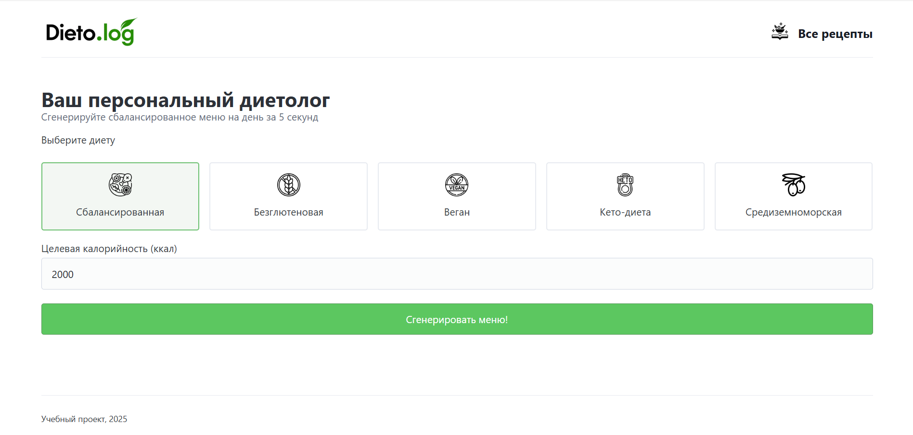

# Dieto.log - Сервис подбора рецептов и генерации меню

**Dieto.log** — это учебный веб-проект, разработанный на фреймворке Django. Сервис предназначен для подбора кулинарных рецептов по различным параметрам и автоматической генерации сбалансированного плана питания на день на основе выбранной диеты и целевой калорийности.    



## 🚀 Основные возможности (Features)

*   **Интеллектуальный генератор меню:** Автоматическое создание плана питания (завтрак, обед, ужин) с подгонкой под заданную калорийность и правила диеты.
*   **Каталог рецептов:** База рецептов с возможностью просмотра детальной информации, включая КБЖУ и пошаговую инструкцию.
*   **Гибкая фильтрация:** Поиск рецептов по диете, типу приема пищи, времени приготовления, названию и входящим в состав ингредиентам.
*   **Динамическая сортировка:** Возможность сортировки каталога по названию и времени приготовления (по возрастанию и убыванию).
*   **Адаптивный дизайн:** Корректное отображение интерфейса на разных типах устройств, от десктопов до мобильных телефонов.

## 🛠 Стек технологий

*   **Бэкенд:** Python, Django
*   **База данных:** PostgreSQL
*   **Фронтенд:** HTML5, CSS3, Pico.css (как основа)
*   **Инструменты:** python-dotenv


### ⚙️ Установка и запуск проекта

Для локального запуска проекта выполните следующие шаги:

1.  **Склонируйте репозиторий:**
    ```bash
    git clone https://github.com/Madvocato/dieto-log.git
    cd dieto-log
    ```

2.  **Создайте и активируйте виртуальное окружение:**
    ```bash
    # Для Windows
    python -m venv venv
    venv\Scripts\activate

    # Для macOS/Linux
    python3 -m venv venv
    source venv/bin/activate
    ```

3.  **Установите зависимости:**
    ```bash
    pip install -r requirements.txt
    ```

4.  **Настройте переменные окружения:**
    *   В проекте есть файл `env.example`. **Скопируйте его** и переименуйте копию в `.env`.
    *   Откройте файл `.env` и впишите свой уникальный `SECRET_KEY`.
        ```
        SECRET_KEY='your-super-secret-key-goes-here'
        DEBUG=True
        ```

5.  **Настройте базу данных PostgreSQL:**
    *   Убедитесь, что у вас установлен и запущен PostgreSQL.
    *   Создайте новую базу данных (например, `dietolog_db`).
    *   Измените данные для подключения к БД в файле `settings.py` в секции `DATABASES`.

6.  **Примените миграции:**
    ```bash
    python manage.py migrate
    ```

7.  **Загрузите начальные данные (рецепты, ингредиенты):**
    *В репозитории находится файл `initial_data.json` с готовым набором данных для демонстрации.*
    ```bash
    python manage.py loaddata initial_data.json
    ```

8.  **Создайте суперпользователя для доступа к админ-панели:**
    ```bash
    python manage.py createsuperuser
    ```

9.  **Запустите сервер разработки:**
    ```bash
    python manage.py runserver
    ```
После этого проект будет доступен по адресу `http://127.0.0.1:8000/`, и в нем уже будут все необходимые данные.
